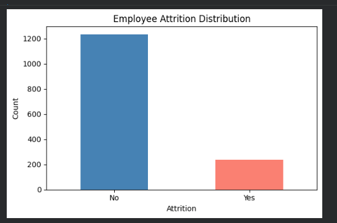
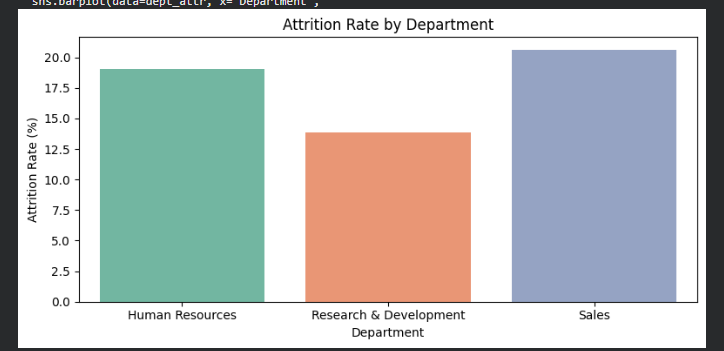
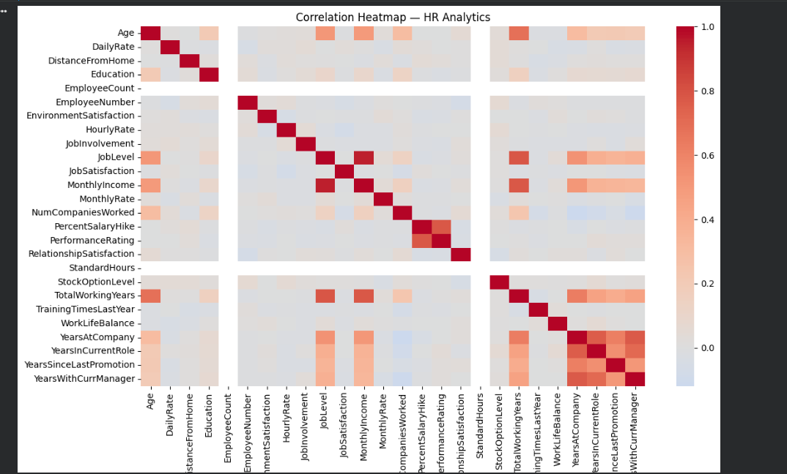
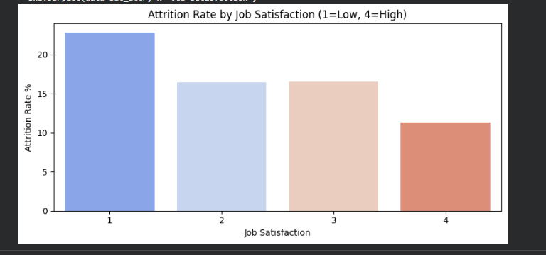

# 🔍 HR Analytics — Employee Attrition Analysis

## Project Overview
Exploratory Data Analysis (EDA) of IBM HR Analytics 
dataset to identify key factors driving employee attrition.

**Dataset:** 1,470 employees | 35 features  
**Tools:** Python, Pandas, Matplotlib, Seaborn

---

## Key Findings

| Factor | Left | Stayed |
|--------|------|--------|
| Avg Age | 33.6 years | 37.6 years |
| Avg Monthly Income | $4,787 | $6,833 |
| Avg Years at Company | 5.1 years | 7.4 years |
| Overtime Attrition Rate | 30.5% | 10.4% |

**Overall Attrition Rate: 16.1%**

---

## Main Insights

1. **Low salary is the biggest driver** — employees 
   who left earned 43% less on average
2. **Young employees are at higher risk** — avg age 
   of those who left is 4 years younger
3. **Overtime triples attrition risk** — 30.5% vs 10.4%
4. **Early tenure is critical** — most attrition happens 
   within the first 5 years

---

## Recommendations

- Review compensation for junior/early-career employees
- Monitor and limit excessive overtime
- Implement retention programs for employees in years 1-5
- Focus engagement efforts on younger workforce segments

- ## Visualizations

### Attrition Distribution

### Age Distribution by Attrition

### Correlation Heatmap

### Years at Company by Attrition

